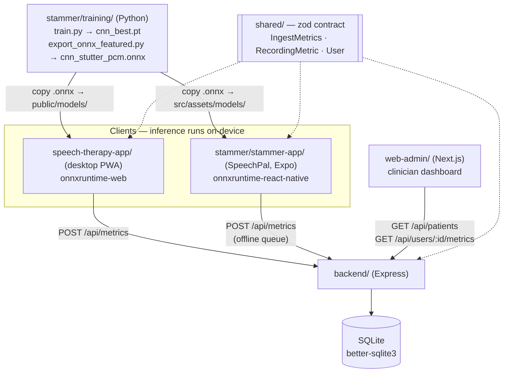

# FluentPath Platform — Monorepo

A speech-fluency / stammering therapy platform. Six components share one typed
contract (`shared/`) and one on-device stutter model (`cnn_stutter_pcm.onnx`).

| Package | Stack | Purpose |
| --- | --- | --- |
| `shared/` | TypeScript + zod (dependency-free) | Domain types + validation schemas — the API contract consumed by every tier. |
| `backend/` | Node.js + Express + TypeScript (tsx) + **better-sqlite3** | Metrics ingestion + user store + REST API + minimal JWT auth. |
| `web-admin/` | Next.js (App Router) | Clinician dashboard — login + patient list with aggregated fluency stats. |
| `speech-therapy-app/` | React 19 + Vite PWA | Desktop client — records audio, runs the stutter model **on-device** (ONNX), shows coaching + progress. |
| `stammer/training/` | Python (librosa + torchaudio) | Trains/fine-tunes the stutter detector and exports it to ONNX for in-browser inference. |
| `stammer/stammer-app/` | React Native (Expo) — "SpeechPal" | Mobile guided-practice app (breathing, metronome, reading, DAF, record-and-score). |

> **Status note.** The mobile client and the model-training pipeline both live
> under `stammer/` (not the `mobile/` name an older README used). The mobile app
> is wired into the platform: it imports `shared/`, runs the ONNX model
> on-device (iOS), and syncs metrics to `backend` — see *Mobile app* below.

## Architecture



- **On-device inference stays local.** The stutter model (ONNX) runs in the
  browser; only the *aggregated metrics* are sent to the backend for
  cross-device sync and clinician review. Raw audio never leaves the device.
- **One shared contract.** `shared/` defines `RecordingMetric`, `IngestMetrics`,
  `User`, etc. The backend validates every request with the same zod schemas the
  clients use, so a breaking change is caught at the type level.
- **`shared/` is imported by the RN app** (`@fluentpath/shared`, `file:` dep).
  The Python training pipeline is the only tier that does not use it.

## Backend

### Run
```bash
cd backend
npm install
npm run dev        # tsx watch, PORT=4000 (set PORT env to override)
npm test           # vitest, in-memory SQLite — no external services
npm run db:reset   # wipe the dev database (data/fluentpath.db)
```

### API
| Method | Path | Auth | Body | Returns |
| --- | --- | --- | --- | --- |
| GET | `/api/health` | open | — | `{ ok, time }` |
| POST | `/api/auth/login` | open | `LoginRequest` | `200 AuthResponse { token, user, refreshToken }` (401 on bad creds) |
| POST | `/api/auth/refresh` | open | `RefreshRequest` | `200 AuthResponse { token, user, refreshToken }` (rotates; 401 on bad/revoked/expired) |
| POST | `/api/auth/logout` | open | `RefreshRequest` | `204` (revokes the refresh token) |
| GET | `/api/me` | token | — | `User` (the caller) |
| POST | `/api/users` | open* | `CreateUser` | `201 User` (*never accepts a password) |
| POST | `/api/metrics` | open | `IngestMetrics` (batch, ≤200) | `202 { accepted, rejected, serverTime }` |
| GET | `/api/users/:id` | token | — | `User` (404 if missing) |
| GET | `/api/users/:id/metrics?limit=` | token | — | `StoredMetric[]` (newest-first) |
| GET | `/api/users/:id/summary` | token | — | `UserSummary` (aggregates + trend) |
| GET | `/api/patients` | clinician | — | `UserSummary[]` (all clients) |

All request/response shapes are in `shared/src/domain.ts`. **Auth model:** client
endpoints (create user, ingest metrics) stay open so the PWA/mobile can sync
without a login — they only ever write their own `userId`'s metrics by UUID and
cannot read anyone else's. Clinician read endpoints require a `Bearer` JWT
(`Authorization` header); `/api/patients` is further restricted to the
`clinician` role.

**Token model:** access tokens are HS256 JWTs, short-lived (15 min). Long-lived
sessions use an **opaque refresh token** (returned on login and `/refresh`,
stored hashed in the `refresh_tokens` table, and revocable via `/logout`).
`/refresh` rotates the refresh token on every use, so a stolen refresh token is
single-use. Passwords are scrypt-hashed. In **production the server refuses to
boot** unless `JWT_SECRET` (≥16 chars) is set and `CORS_ORIGINS` is explicit
(not `*`); the dev-only fallback secret must never reach production.

### Web admin
```bash
cd web-admin
npm install
npm run dev        # http://localhost:3000 (set NEXT_PUBLIC_BACKEND_URL to the backend)

The admin keeps the access + refresh tokens in `sessionStorage`; the API client
(`web-admin/src/lib/api.ts`) transparently refreshes the access token on a 401 and
revokes the refresh grant on logout, so clinicians stay signed in across the 15-min
access-token window without re-entering credentials.
```
The backend **auto-seeds a default clinician on startup** (via `repo.ensureSeeded`).
Default credentials unless overridden by env:
`clinician@fluentpath.dev` / `fluentpath-dev-1234`. Override with
`CLINICIAN_EMAIL` / `CLINICIAN_PASSWORD` / `CLINICIAN_NAME` (set `JWT_SECRET` in
prod). The `npm run seed:clinician` script is an offline alternative for seeding a
DB file that no running server holds.

### Data layer
- **better-sqlite3** uses SQLite's native file locking and prepared statements.
- **Durability:** WAL mode, foreign-key enforcement, a 5-second busy timeout, and
  `synchronous=FULL` are configured at startup. Every mutating request commits
  immediately; no export or shutdown flush is required.
- **Deployment:** keep `data/fluentpath.db`, `data/fluentpath.db-wal`, and
  `data/fluentpath.db-shm` on persistent local storage. For multiple application
  instances, move this data layer to a managed server database such as Postgres.

## Model training (`stammer/training/`)

Python pipeline that produces the on-device stutter model. Two model paths:

| Model | Input | Notes |
| --- | --- | --- |
| `cnn` (default) | librosa log-Mel (3 × 64 × 128, with delta/delta²) | Fast baseline, CPU-friendly |
| `wav2vec2` | raw 16 kHz waveform | Fine-tunes `torchaudio` Wav2Vec2 base |

> ⚠️ The bundled dataset is **synthetic** (`generate_data.py`) — only to verify
> the pipeline runs end-to-end. **Not** clinical data. Swap in a licensed corpus
> (UCLASS, FluencyBank, KCL) via `prepare_real_corpus.py` to train a usable model.

### Setup & run
```bash
cd stammer
uv venv .venv
uv pip install --python .venv .venv -r training/requirements.txt
uv pip install --python .venv onnx onnxruntime onnxscript   # for ONNX export

# Generate the synthetic dataset (first run)
.venv/Scripts/python.exe training/generate_data.py
# Smoke test: datasets + both models build and forward-pass
.venv/Scripts/python.exe training/smoke_test.py
# Train the CNN baseline -> checkpoints/cnn_best.pt + metrics.json
.venv/Scripts/python.exe training/train.py --model cnn --epochs 8
# Fine-tune Wav2Vec2 (downloads ~360MB checkpoint first run)
.venv/Scripts/python.exe training/train.py --model wav2vec2 --epochs 4
# Score one audio file
.venv/Scripts/python.exe training/infer.py training/checkpoints/cnn_best.pt path/to/audio.wav
```

### Export to ONNX (feeds the web app)
`export_onnx_featured.py` builds a single ONNX graph that takes **raw 16 kHz mono
PCM** and internally performs the exact librosa feature extraction (log-Mel +
deltas) the model was trained on, then runs the CNN — guaranteeing Python/browser
feature parity.
```bash
.venv/Scripts/python.exe training/export_onnx_featured.py
# -> training/onnx/cnn_stutter_pcm.onnx   (input: pcm [1, T], output: logit [1])
```
Copy the result into the PWA:
```bash
cp stammer/training/onnx/cnn_stutter_pcm.onnx speech-therapy-app/public/models/
```
The React app loads it via `onnxruntime-web` (`speech-therapy-app/src/lib/stutterModel.ts`,
`STUTTER_MODEL_URL = '/models/cnn_stutter_pcm.onnx'`) and scores each recording
fully on-device.

### Files
- `generate_data.py` — synthetic dataset generator (uses `soundfile`)
- `dataset.py` — `StutterDataset` (librosa mel) + `RawStutterDataset` (waveforms)
- `models.py` — `StutterCNN`, `Wav2Vec2StutterClassifier`, `build_model()`
- `train.py` — training / fine-tuning driver (BCE loss, AdamW, best-checkpoint)
- `infer.py` — load a checkpoint and score one audio file
- `smoke_test.py` — pipeline self-check
- `export_onnx_featured.py` — export CNN + librosa frontend to ONNX (raw PCM in)
- `export_onnx.py` / `export_onnx_raw.py` — alternate export paths (feature-input / raw-input graphs)
- `prepare_real_corpus.py` — resample a real corpus to `file,label` format
- `download_uclass.py` — UCLASS data-request + prep scaffold (license-gated)
- `dump_reference.py` / `dump_melfb.py` / `evaluate.py` / `metrics.json` — parity/debug/eval helpers

## Mobile app (`stammer/stammer-app/` — "SpeechPal")

React Native app built with **Expo** (SDK 52, React 18, `expo-router`) — the
platform's mobile client.

- Screens: guided home hub, **Breathing**, **Metronome**, **Reading**, **DAF**
  (delayed auditory feedback), and a **Speech Training** record/score screen.
- **Platform wiring** (all in `stammer-app/lib/`, imported as `@/lib/*`):
  - `identity.ts` — anonymous per-device UUID, registered via `POST /api/users`.
  - `stutterModelRN.ts` — loads the bundled `src/assets/models/cnn_stutter_pcm.onnx`
    with `onnxruntime-react-native` (same raw-PCM contract as the PWA).
  - `analyzeRecording.ts` — decodes the recording, runs the model, and builds a
    `RecordingMetric` / `IngestMetrics` payload typed by `@fluentpath/shared`.
  - `syncQueue.ts` — AsyncStorage-backed offline queue; flushes to
    `POST /api/metrics` after each recording and on app foreground.
- **Platform caveat:** iOS records 16 kHz mono WAV, so the model scores every
  recording. Android's `MediaRecorder` cannot write WAV, so Android recordings
  are AAC and sync with `pStutter = null` (duration + self-rated ease only)
  until a native PCM recorder or decoder is added.
- `onnxruntime-react-native` is a native module: use a dev build
  (`npx expo run:ios` / `run:android`), not Expo Go.
- Set the backend with `EXPO_PUBLIC_BACKEND_URL` (defaults to `localhost:4000`,
  or `10.0.2.2:4000` on the Android emulator).
- Package name is `speechpal`.

### Run
```bash
cd stammer/stammer-app
npm install
npm start            # expo start (then open on device / sim / web)
```


## What's verified
- `backend`: `tsc` clean, 18 vitest integration tests (real in-memory
  SQLite via supertest) covering users CRUD, metrics ingest + read, validation
  rejections, user-scoping, 401/403 auth gating, login, **refresh-token
  issue / rotate / logout**, and clinician patient summaries with trend.
- `shared`: `tsc --noEmit` clean (contract types + zod schemas).
- `web-admin`: `next build` succeeds (App Router, login + patient list + detail); the client persists the opaque refresh token, silently refreshes the access token on 401, and revokes the grant on logout.
- `speech-therapy-app`: loads `cnn_stutter_pcm.onnx` and scores on-device via
  `onnxruntime-web`.
- Live smoke test confirmed a user + metric survive a full server restart
  (write-through persistence).

## Not yet done (next slices / hardening)
- **On-device scoring on Android** — add a native PCM recorder (or an AAC
  decoder) so Android recordings can be fed to the model like iOS ones.
- **On-device STT for the mobile heuristic** — without a transcript the
  repetition/prolongation/block counts are zero on mobile.
- **Train on a real corpus** — the committed model is from the synthetic dataset;
  swap in UCLASS/FluencyBank/KCL and retrain for real-world accuracy.
- **Production hardening (remaining):** move to a managed server database such as
  Postgres if deploying multiple backend instances. Refresh tokens, auth rate
  limiting, better-sqlite3 durability, and fail-closed secret/CORS boot checks are
  done.

## Known issues (as of this revision)
- **Unresolved merge-conflict markers are committed** in
  `stammer/training/models.py` (the `StutterCNN` pooling layer) and
  `stammer/training/README.md`. These break the training code / render the README
  malformed and must be resolved before retraining or publishing. Tracked for fix.
- `backend/scripts/resetDb.mjs` is **deleted** but `npm run db:reset` still
  references it — the reset script needs restoring or the npm script removed.
